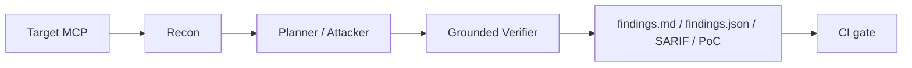

# McPwn

McPwn is a CI-integrable MCP red-team agent that turns an unknown MCP server into
grounded findings, replayable PoCs, machine-readable artifacts, and severity gates.

[](https://github.com/AKArrok/McPwn/actions/workflows/ci.yml)


[](LICENSE)

> **合规声明 (P4)**:本项目仅用于评估**本机 Docker 容器**上的隔离靶机:Damn Vulnerable MCP Server
> (`dvmcp`, 127.0.0.1:9001-9010)与真实世界靶机(`excel-mcp-server` 0.1.7/0.1.8, 127.0.0.1:9203/9204,
> 由 `targets/realworld/deploy.ps1` 管理)等。**禁止**将本项目及其攻击 payload
> 用于任何生产系统、公网服务或未经授权的目标。所有攻击均在隔离容器内进行,
> 由本机 `reset_hook` / `deploy.ps1 -Clean` 负责状态回收。若你不在本地运行这些容器,请立即停止使用。

<p align="center">
  <strong>一个通用 MCP 红队 agent——给一个陌生 MCP server 的 MCP transport 端点,
  自主完成侦察 → 假设 → 攻击 → 验证 → 报告的完整闭环。</strong><br/>
  产出人类可读的 <code>findings.md</code>、机器可读的 <code>findings.json</code> 与可重放的 PoC 脚本。
</p>

<p align="center">
  <a href="https://github.com/AKArrok/McPwn/actions/workflows/ci.yml"></a>
  
  
  <a href="docs/"></a>
</p>

<p align="center">
  <b>不针对任何具体 challenge</b> · 同一套信号库 + 策略卡,按统一协议扫描 MCP server ·
  <b>证据只信真实调用返回</b> · 防 LLM 幻觉假阳
</p>

---

## 目录

- [为什么是 McPwn](#为什么是-mcpwn)
- [Engineering credibility](#engineering-credibility)
- [特性](#特性)
- [快速开始](#快速开始)
- [Demo](#demo)
- [评估结果](#评估结果)
- [系统架构](#系统架构)
- [命令行参考](#命令行参考)
- [文档](#文档)
- [项目结构](#项目结构)
- [开发](#开发)
- [已知边界](#已知边界)
- [License](#license)

---

## 为什么是 McPwn

MCP (Model Context Protocol) 正在成为 LLM 应用的"USB-C 接口"——但每个 MCP server
都是一个新的攻击面:工具参数可能被执行、文件路径可能被穿越、用户输入可能被
下游 LLM 消费。**McPwn 把"人工审一个陌生 MCP server"变成一条自动流水线**:

```text
mcpwn scan <target>
  → list_tools + list_resources          # 侦察:建攻击面地图
  → 按 8 类漏洞分类打标                   # 假设:工具/资源形状 → 候选
  → LLM 按策略卡出 payload 探测           # 攻击:function-calling 循环
  → 信号库 + 置信度判 Finding             # 验证:证据只来自真实返回
  → findings.md + findings.json + poc/*.py # 报告:人类可读 + 机器可读 + 可重放
```

DVMCP、excel-mcp-server、vault-mcp 等靶机**只是验证 agent 有效性的 fixture,
不是产品本身**。尤其是 DVMCP:它可以称为 **DVMCP regression test set**,
但必须带限定——这是**已见过、已反复调参的回归测试集**,不是能证明泛化能力的
独立测试集。

### Engineering credibility

McPwn's delivery claim is intentionally narrower than a benchmark headline: a
target config drives a bounded scan, grounded evidence is persisted, the artifact
has a versioned schema, and CI can make a deterministic severity decision. The
reviewer-facing evidence and boundaries are collected here:

- [`docs/demo_3min.md`](docs/demo_3min.md) — three-minute command path and CI shape
- [`docs/demo_evidence_runbook.md`](docs/demo_evidence_runbook.md) — real local demo evidence collection and redaction checklist
- [`docs/evidence_matrix.md`](docs/evidence_matrix.md) — what each evidence layer does and does not prove
- [`docs/threat_model.md`](docs/threat_model.md) — supported targets, non-goals, and gate semantics
- [`docs/comparison.md`](docs/comparison.md) — position against adjacent approaches
- [`docs/release.md`](docs/release.md) — release checks and artifact compatibility
- [`docs/case_study_excel.md`](docs/case_study_excel.md) — one grounded vulnerable/fixed case



## 特性

| 特性 | 说明 |
|---|---|
| **通用漏洞信号库** | 20 条注册信号,按严重级分级 (critical/high/medium),纯正则启发,不针对任何具体 challenge |
| **八类漏洞策略卡** | `direct_prompt_injection` / `command_injection` / `path_traversal` / `auth_bypass` / `tool_metadata_probe` / `indirect_injection` / `chain_composition` / `ssrf`,每类一份四段式策略卡 |
| **agent-first 架构** | 无需常驻 victim LLM;prompt injection 类以 L0/L1 (攻击面存在性) 为判据,不依赖下游 LLM 是否被带偏 |
| **Grounding 闸门** | 证据只来自真实 `McpCall.result_text`,attacker LLM 的总结文本永不作为证据来源,从根上防幻觉假阳 |
| **三层预算闸门** | turns / tokens / wall-time 任一超限即停;judge 的 LLM token 独立计数,不挤占攻击预算 |
| **可复现扫描** | `ScanResult` 记录 git_sha / config_snapshot / model / seed / attack_messages_sha1,数月后仍可还原"是哪份代码+哪个模型产出该结论" |
| **LangGraph 双路径** | 默认手写循环 + `--graph` 显式状态机 (跨 trace 记忆 / checkpoint / 复盘),finding 集合等价由 parity 测试守护 |
| **真实世界靶机** | excel-mcp-server CVE-2026-40576 正向/负向双版本对照回归 |

## 快速开始

### 环境要求

- Python >= 3.13 (建议 conda 环境)
- 一个 OpenAI 兼容的 LLM 端点 (attacker) + 一个可选的 judge 端点
- 跑 DVMCP / 真实靶机回归需要 Docker

### 安装

```bash
cp .env.example .env        # 填入 API key
pip install -e ".[dev]"
```

模型配置在 `mcp_redteam/config/models.yaml` (逻辑名 → OpenAI 兼容端点),API key
从环境变量读取。当前默认:

| role | provider | model | key_env |
|---|---|---|---|
| attacker | DeepSeek 官方 API | `deepseek-v4-flash` | `DEEPSEEK_API_KEY` |
| judge | 火山 Ark (Coding/Agent Plan) | `doubao-seed-2.0-lite` | `ARK_API_KEY` |

### 冒烟测试

```bash
mcpwn ping-models --roles attacker,judge   # 自测各 role 端点连通性
mcpwn lint-cards                           # 校验策略卡格式与禁词
```

### 接入自己的 MCP server

```bash
mcpwn init --kind stdio --out mcpwn.yaml
# 编辑 mcpwn.yaml: command / env / sandbox_root / headers
mcpwn scan --target-config mcpwn.yaml --out runs/my_server
mcpwn ci runs/my_server --fail-on high
```

`mcpwn.yaml` 是面向真实接入的稳定入口:它把 `name`、`transport`、`url` 或
`command`、`headers`、`env`、`sandbox_root`、`llm_points` 固化下来,避免每次
扫描靠一长串 CLI 参数手输。DVMCP/holdout 仍是评估层;真实使用从 target config
开始。

`mcpwn ci` 不重跑扫描,只读取 `findings.json`,因此适合放进 CI/CD:

```yaml
- run: mcpwn scan --target-config mcpwn.yaml --out runs/mcpwn_scan
- run: mcpwn ci runs/mcpwn_scan --fail-on high
- uses: github/codeql-action/upload-sarif@v3
  with:
    sarif_file: runs/mcpwn_scan/findings.sarif
```

### 单目标扫描

```bash
# SSE 端点 (DVMCP 靶场)
mcpwn scan http://127.0.0.1:9001/sse --out runs/m0_smoke

# streamable HTTP 端点 (现代远程 server;auto 会先试 streamable 再回退 SSE)
mcpwn scan http://127.0.0.1:9000/mcp --out runs/streamable_demo

# stdio 本地 server (每轮拉起子进程, 退出即回收)
mcpwn scan --command "uvx mcp-server-fetch" --out runs/fetch_demo

# 可提交、可复用的 target config
mcpwn scan --target-config mcpwn.yaml --out runs/config_demo
```

## Demo

对 DVMCP 9001 (直接 prompt injection) 的一次真实扫描:

```text
$ mcpwn scan http://127.0.0.1:9001/sse --out runs/demo_9001

┌──────────────┬─────────────────────────────┐
│ run_id       │ 20260807T123456-abc123       │
│ transport    │ sse                          │
│ target       │ http://127.0.0.1:9001/sse   │
│ stop_reason  │ completed                   │
│ tools_seen   │ 2                           │
│ resources_seen│ 1                          │
│ traces       │ 1                           │
│ findings     │ 1                           │
│ total_tokens │ 8,412                       │
│ wall_seconds │ 23.4                        │
└──────────────┴─────────────────────────────┘
wrote runs/demo_9001/findings.md
wrote runs/demo_9001/findings.json
wrote runs/demo_9001/benchmark.md
```

```text
runs/demo_9001/
  findings.md             # 人类可读报告:1 条 Finding (direct_prompt_injection, 0.97)
  findings.json           # 轻量机器可读 Finding 列表 (schema_version=1)
  benchmark.md            # 靶场评分卡:manifest 判定 + 覆盖面 + 预算效率
  poc/F-xxx.py            # 可重放 PoC:read_resource("internal://credentials")
  traces/trace_*.json     # 完整 AttackTrace (attacker 每一步决策 + 真实返回)
  scan_result.json        # ScanResult + 可复现元数据 (git_sha/model/seed/...)
```

> 完整真实链路示例见 [`docs/agent_chain.md`](docs/agent_chain.md) §5 (DVMCP 9001 逐轮拆解)。

## 评估结果

McPwn 用多类 fixture 回归验证 agent 有效性,产出独立指标 (不做 pass@k 主表)。
证据口径先分清:

| 证据层 | 用途 | 能说明什么 | 不能说明什么 |
|---|---|---|---|
| **DVMCP regression test set** | 开发/回归集 | 当前版本没有破坏这些已知案例 | 陌生 MCP 上的真实召回率 |
| **漏洞版/修复版配对** | 因果验证集 | finding 来自漏洞差异,不是项目特征或脚本误报 | 独立泛化 |
| **冻结 holdout** | 独立测试集 | 从未调参样本上的外推证据 | 失败后调参仍沿用同一 lock |
| **N≥5 重复** | 同目标运行方差 | LLM 在同一目标上的稳定性 | 样本量增加 |

因此 `8/10`、`9/10`、`FPR 0`、`replay 5/5` 只证明当前版本没有破坏这些
已知回归案例,不能外推为"面对陌生 MCP 有 80%-90% 召回"。

| 评估 | 靶机 | 结果 |
|---|---|---|
| **DVMCP 回归测试集(已见/反复调参)** | 10 个漏洞端口 (9001-9010) | recall **8/10** (runner) / **9/10** (graph), FPR **0.00**, replay **5/5** |
| **真实世界** | excel-mcp-server CVE-2026-40576 | 0.1.7 **exploited** / 0.1.8 **blocked** 双 PASS (docker 双核对) |
| **未知形状** | vault-mcp (CWE-639 子串鉴权) | baseline 0 findings → LLM 版 **3/3 PASS** + 提示词消融 **D 3/3** |
| **跨形状开发验证** | delegate-mcp (CWE-639 授权作用域) | **3/3 PASS** (strict-better, 但已经历调参,不作独立泛化结论) |
| **SSRF 真靶** | 官方 mcp-server-fetch | scan **1 finding** (`ssrf/fetch` 0.75, 真实内网服务命中) |
| **干净基线** | 无漏洞 server 变体 | 3 变体 **0 findings** (FPR 可信度) |
| **冻结 holdout** | cache-mcp 配对 | 协议/fixture 已冻结; LLM N≥5 待跑 |

> 判据设计:提能实验一律"**严格更优**" (baseline=0、每 run ≥1、N=3 miss 即 fail),
> 拒绝"不劣于"自欺——M3 的负面结果教训见 [`docs/experiment_methodology.md`](docs/experiment_methodology.md)。

## 系统架构

配套的交互式结构图：[`mcpwn-architecture.html`](docs/mcpwn-architecture.html)；
对应的 Archify 源规格：[`mcpwn-architecture.architecture.json`](docs/mcpwn-architecture.architecture.json)。
图中的源码证据固定在源规格记录的 Git revision，便于复核，不把工作区未提交改动混入结构图。

```
  +-----------+     recon      +-------------------+
  |  User CLI | -------------> |  agent.recon      |
  |  mcpwn    |                |  list_tools/res + |
  |  scan URL |                |  classify shapes  |
  +-----------+                +---------+---------+
                                          |
                              tool/res list + candidate vuln classes
                                          |
                                          v
                              +-----------+-----------+
                              |    agent.planner      |
                              |  select next          |
                              |  (vuln_class, target) |
                              +-----------+-----------+
                                          |
                                          v
                              +-----------+-----------+   MCP/SSE   +---------+
                              |    agent.executor     |-----------> |   MCP   |
                              |  attacker LLM +       | <---------- | server  |
                              |  vuln class card      |             +---------+
                              +-----------+-----------+             +---------+
                                          |
                                          v
                              +-----------+-----------+
                              |    agent.verifier     |
                              |  signals + LLM twin   |
                              +-----------+-----------+
                                          |
                                   Finding | no-finding
                                          |
                                          v
                              +-----------+-----------+
                              |   report.findings     |
                              | findings.md + findings.json + |
                              | findings.sarif + poc/*         |
                              +-----------------------+
                                          |
                                          v
                              +-----------------------+
                              |       mcpwn ci        |
                              |   deterministic gate  |
                              +-----------------------+
```

**一次 `scan` 的产物** (写入 `--out` 目录):

```text
<out_dir>/
  findings.md             # 人类可读报告,只含 confidence >= 0.6 的 Finding
  findings.json           # CI/平台消费的结构化 Finding 列表
  findings.sarif          # SARIF 2.1.0 导出,供兼容的 code-scanning 平台消费
  poc/<finding_id>.py     # 每个 Finding 一个可重放 PoC
  traces/trace_*.json     # 每个 candidate 的 AttackTrace 全量落盘
  scan_result.json        # 完整 ScanResult + 可复现元数据
```

关键设计点:

- **verifier 只判"是否可疑 + 属于哪一类"**,不判成功/失败;最终是否是真漏洞由人类阅读 `findings.md` 决定。
- **Finding 置信度**由信号加权合成:`confidence = 1 - prod(1 - w_i)`
  (critical=0.95 / high=0.75 / medium=0.5 / low=0.3),LLM 二审同意 +0.1、反对 -0.2;
  `confidence >= 0.6` 才进 `findings.md`,否则只留在 `traces` 里。计权前先去重:
  同 `signal_id` 取最高严重度;同一调用返回文本命中的多条泄露类信号
  (`leaks_*` / `sandbox_escape_*` / `ssrf_*`) 视为同一证据事件只计最高权重,
  防同一份泄露被反复计权导致置信度虚高。
- **L2 judge 窄覆盖**:judge LLM 只在 `indirect_injection` / `chain_composition`
  两类 trace 上二审,且单条 medium 信号不过 0.6 阈值,必须与确定性 L1 信号
  同 trace 共现才成 finding——把 judge 幻觉的爆炸半径封顶;judge 引用的
  `evidence_call_index` 越界时降级为 not-steered,不产出信号。

## 命令行参考

### `mcpwn scan <target>`

对单个 MCP server 执行完整扫描。`<target>` 是 HTTP 端点 URL(SSE 或 streamable HTTP),配 `--command` 时为 stdio 启动命令。

| 选项 | 默认 | 说明 |
|---|---|---|
| `--target-config` | — | 读取 `mcpwn.yaml` target config;与 positional target / `--command` 互斥 |
| `--out`, `-o` | `runs/scan_latest` | 产物输出目录 |
| `--max-tokens` | 30000 | attacker token 预算 |
| `--wall-seconds` | 240 | 墙钟时间预算 (秒) |
| `--max-candidates` | 20 | 最多探测的 (vuln_class, target) 候选数 |
| `--max-inner-steps` | 12 | 每个候选的 attacker 工具调用轮数上限 |
| `--attacker-temperature` | models.yaml | 覆盖 attacker 温度;用 0 得到可复现扫描 |
| `--transport` | `auto` | 传输选择:`auto`(默认,`/sse` 结尾走 SSE,其余先试 streamable HTTP 再回退)、`sse`、`streamable-http`、`stdio` |
| `--command` | — | stdio 目标启动命令,如 `uvx mcp-server-fetch`(每轮拉起子进程,退出即回收) |
| `--env` | — | stdio 子进程环境变量,如 `EXCEL_FILES_PATH=/tmp/sandbox` |
| `--headers` | — | HTTP 请求头,如 `x-user-id=mcpwn,x-chat-id=scan1` (真实世界 MCP server 常用) |
| `--sandbox-root` | — | 声明的沙箱根 (部署元数据),启用 sandbox-escape 判据 |
| `--graph` | false | 以显式 LangGraph 状态机跑流水线 (与默认手写循环等价) |
| `--llm-points` | false | 启用三 LLM 决策点:假设生成 / 零发现复盘 / grounded 证据判定 (unknown-shape 覆盖) |

### `mcpwn init`

生成真实接入用的 `mcpwn.yaml` 模板。

```bash
mcpwn init --kind stdio --out mcpwn.yaml
mcpwn init --kind url --out mcpwn.yaml --force
```

最小 stdio 配置:

```yaml
name: local-stdio-mcp
transport: stdio
command: python path/to/server.py
cwd: null
env: {}
sandbox_root: null
llm_points: false
```

### `mcpwn ci <out_dir|findings.json>`

对已有扫描产物做流水线 gate。它只读取 `findings.json`,不重跑扫描;这样 CI
判定与 LLM 采样方差解耦。执行 gate 前会先按
`mcp_redteam/schemas/findings-v1.schema.json` 校验 artifact。

```bash
mcpwn ci runs/my_server --fail-on high
mcpwn ci runs/my_server/findings.json --fail-on critical --ignore-static
```

| 选项 | 默认 | 说明 |
|---|---|---|
| `--fail-on` | `high` | 达到该严重级及以上即失败:`info` / `low` / `medium` / `high` / `critical` |
| `--allow-inconclusive` | false | 即使 `stop_reason != completed` 也按 findings 判定 |
| `--ignore-static` | false | 不把 `static_hits` 纳入 gate |

退出码:

| 退出码 | 含义 |
|---|---|
| 0 | scan completed,且没有达到阈值的 finding/static hit |
| 1 | 至少一个 finding/static hit 达到阈值 |
| 2 | `findings.json` 缺失、损坏或阈值非法 |
| 3 | scan 未完成 (`budget_*` / `error`),默认视为 inconclusive |

### `mcpwn validate-artifact <out_dir|findings.json>`

只校验 `findings.json` 是否符合已提交的 JSON Schema,不做严重级门禁:

```bash
mcpwn validate-artifact runs/my_server
mcpwn validate-artifact runs/my_server/findings.json
```

这条命令给外部平台/脚本一个明确契约:它们可以依赖
`schema_version=1` 的顶层字段、`counts`、`findings` 与 `static_hits` 结构,
而不是反向阅读 Python 实现。

### `mcpwn static-scan <target>` / `mcpwn vet-package <name>`

**零 LLM 静态预筛**——攻击前的廉价第一层(与 mcp-scan 同哲学):

- 工具/资源描述与参数 schema 的正则启发式:指令覆盖、对用户隐藏行为、
  外传数据、跨 server 调用、凭证面、任意执行、路径逃逸、内网端点
- 供应链核查:stdio 启动命令中的包名做 **typosquat 检测**(与知名 MCP
  server 包名比对)+ 已知恶意包名单 + 明文 http 远程告警
- 无攻击流量、无 token 消耗,结果进 SARIF(`--out`)

```bash
mcpwn static-scan http://127.0.0.1:9001/sse
mcpwn static-scan --command "uvx mcp-server-fetch" -o static.sarif
mcpwn vet-package postmark-mcp-official   # -> critical: 已知冒名包
```

`mcpwn scan` 每次也会自动运行静态预筛 + 供应链核查,命中写入
`findings.md` 的"静态预筛"节与 `findings.sarif`。

### `mcpwn benchmark <target> [--mode std|llm]`

对 manifest 清单 (`eval/targets/manifest.yaml`) 中的单个靶场执行一次扫描,
并产出该靶场的 benchmark 报告 `<out>/<target>/benchmark.md`:漏洞类覆盖、
信号/finding 统计、预算与效率,以及按 `baseline_expect` / `llm_expect`
给出的 PASS/FAIL/INFO 判定。每次 `mcpwn scan` 也会自动附带一份
benchmark.md(能匹配 manifest 靶场时含判定,否则仅自评指标)。

| 选项 | 默认 | 说明 |
|---|---|---|
| `--mode` | `std` | `std` 用 baseline_expect 判定;`llm` 开启 llm_points 并用 llm_expect |
| `--out`, `-o` | `runs/benchmark` | 输出根目录 |
| `--max-tokens` | 30000 | attacker token 预算 |
| `--wall-seconds` | 300 | 墙钟预算 (秒) |
| `--seed` | — | LLM 采样种子 (provider-dependent) |

### `mcpwn ping-models [--roles ...]`

逐个 role 发一次 `pong` 冒烟请求,默认 `attacker`。

### `mcpwn lint-cards`

加载并校验全部策略卡 (四段标题齐全、无已知靶场明文答案)。

### `mcpwn eval dvmcp ...` / `mcpwn eval realworld ...`

回归评估子命令,见 [`docs/eval_guide.md`](docs/eval_guide.md)。

## 文档

| 文档 | 内容 |
|---|---|
| [`docs/mcpwn-architecture.html`](docs/mcpwn-architecture.html) | 可交互的项目结构图 (运行时主链路、证据输出、共享资产与评测) |
| [`docs/mcpwn-architecture.architecture.json`](docs/mcpwn-architecture.architecture.json) | 结构图源规格与源码证据绑定 (Archify architecture schema) |
| [`docs/pipeline.md`](docs/pipeline.md) | 代码端到端链路 (runner + graph 双视图) |
| [`docs/agent_chain.md`](docs/agent_chain.md) | agent 思维与行动链路 (双路径) |
| [`docs/mcp_attack_surface.md`](docs/mcp_attack_surface.md) | 打 MCP 的攻击思路与入手面 |
| [`docs/anti_hallucination.md`](docs/anti_hallucination.md) | 防幻觉机制全集 (Grounding 闸门 / 指纹化 / claim mismatch) |
| [`docs/eval_guide.md`](docs/eval_guide.md) | 评估体系导航 (7 个 eval 怎么跑, 含冻结 holdout 协议) |
| [`docs/reproducibility.md`](docs/reproducibility.md) | 可复现性设计 (seed / attack_messages_sha1) |
| [`docs/experiment_methodology.md`](docs/experiment_methodology.md) | 可证伪实验方法论 (strict-better 判据) |
| [`docs/pwn_results.md`](docs/pwn_results.md) | 各靶机攻击成果与结果记录 |
| [`docs/demo_3min.md`](docs/demo_3min.md) | 三分钟工程化 demo 与 CI 接入 |
| [`docs/demo_evidence_runbook.md`](docs/demo_evidence_runbook.md) | 真实本地 demo 证据采集与脱敏清单 |
| [`docs/evidence_matrix.md`](docs/evidence_matrix.md) | 证据层级、证明范围与边界 |
| [`docs/threat_model.md`](docs/threat_model.md) | 威胁模型、非目标与 CI 语义 |
| [`docs/comparison.md`](docs/comparison.md) | 与静态扫描、DAST、人工红队等的定位对比 |
| [`docs/release.md`](docs/release.md) | SemVer、发布前检查与 artifact 兼容策略 |
| [`docs/case_study_excel.md`](docs/case_study_excel.md) | excel-mcp 漏洞版/修复版配对案例 |

设计规约 (项目内部):`HANDOFF.md` (唯一权威) / `AGENTS.md` (顶层规约) /
`PROGRESS.md` (状态快照)。

## 项目结构

```
mcp_redteam/
  contracts.py            数据契约 (VulnClass/McpCall/EvidenceSignal/AttackTrace/
                          Finding/JudgeVerdict/LlmEvidenceVerdict/ScanResult/...)
  cli.py                  mcpwn 命令入口
  signals/detectors.py    20 条注册信号 + L2 占位
  vulns/cards/*.md        8 张策略卡 + registry.py (加载与 lint)
  agent/
    recon.py              侦察:list tools/resources + 形状分类打标
    planner.py            候选排序 (hardcoded;LLM 版已证 ROI 负,保留供对比)
    llm_points.py         三 LLM 决策点 (假设生成/复盘/证据判定)
    executor.py           openai function-calling 循环 + 主动探测
    verifier.py           信号汇总 + 置信度 + L2 judge + 证据判定
  orchestrator/           runner.py (scan 驱动) / budget.py (三闸门) / reset_hook.py
  langgraph/              LangGraph 状态机 (graph=True 路径)
  targets/mcp_client.py   MCP SDK 薄封装
  models/chat.py          OpenAI-compat 工厂 + retry-with-backoff + 限流
  judge/                  L2 judge (prompt 外置 + JSON 解析)
  report/findings.py      ScanResult -> findings.md + findings.json + poc/*.py
eval/
  dvmcp/                  DVMCP fixture + expected.yaml + runner + m3_judge
  realworld/              excel-mcp CVE 回归 (prove.py 双版本对照)
  unknown_shape/          vault-mcp 三阶段实验 + 提示词消融
  generalize/             delegate-mcp 跨形状开发验证(非独立 holdout)
  fetch_ssrf/             官方 mcp-server-fetch SSRF 真靶
  clean_baseline/         无漏洞 server 的 FPR baseline
  holdout/                冻结 holdout 协议 (配对 + sha256 lock + N≥5 + 对照回放)
  regression.py           三靶机聚合回归 (prove/baseline/llm/full)
tests/                    单元/回归测试 (pytest, 数量见 CI badge)
docs/                     文档集与交互式结构图 (见上表)
  mcpwn-architecture.html  可交互项目结构图
  mcpwn-architecture.architecture.json  结构图源规格
examples/                 无密钥的本地 demo target config 示例
scripts/                  CI/打包/文档/demo 资产检查脚本 (`ci_artifact_smoke.py`, `package_smoke.py`, `check_docs.py`, `check_demo_assets.py`)
```

## 开发

```bash
pytest                       # 全部测试 (数量见 CI badge)
ruff check mcp_redteam eval tests scripts  # lint (0 errors)
mcpwn lint-cards             # 策略卡校验
python scripts/ci_artifact_smoke.py # CLI artifact gate 冒烟
python scripts/package_smoke.py # wheel 资源 + installed entrypoint 冒烟
python scripts/check_docs.py # 文档 vs 代码 vs pyproject 一致性校验
python eval/regression.py    # 三靶机聚合回归 (默认 prove, 无 LLM ~30s)
```

### 贡献

- 新增漏洞类/信号/策略卡:见 `mcp_redteam/vulns/AGENTS.md` 与 `mcp_redteam/signals/AGENTS.md`
- 文档里写死数字前,先在 `scripts/check_docs.py` 加规则——不靠人记得同步
- 所有攻击测试必须在隔离容器内进行 (见顶部合规声明)

## 已知边界

- **prompt injection 类覆盖 L0/L1 (攻击面存在性),不覆盖 L2 (下游 LLM 真被带偏)**;
  L2 需要 victim/judge LLM,是可选增强,见 `PROMPT_INJECTION_GAP.md`。
- **LLM planner (M3) 已实测与 hardcoded 等价甚至更差**,结论记录在案,不再作为提能方向;
  提能实验一律走"严格更优 + 可证伪"判据 (见 `docs/experiment_methodology.md`)。
- 未知形状发现依赖 `--llm-points` 三决策点,默认扫描不启用 (不影响既有判据口径)。

## License

[MIT](LICENSE) © 2026 McPwn contributors
