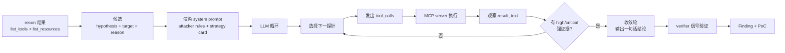

# McPwn Agent 链路

> 本文描述 **agent 的思维与行动链路**,不是代码模块调用链。
> 代码怎么连(CLI → runner → recon → planner → executor)见各子目录
> `AGENTS.md`;本文回答的是另一个问题:**给定一个 MCP server,agent 是怎么
> 一步步决定“先探什么、发什么 payload、拿到结果后怎么判断、什么时候停”**。

---

## 1. 先定义:这个 agent 是什么

McPwn 的 attacker 是一个 **OpenAI-compatible function-calling LLM**,它的工作方式
不是一个“自动跑完整个流程的脚本”,而是:

- 系统一次性给它当前候选的**任务上下文**;
- 它每轮只能做两件事:调 MCP tool,或者输出最终结论;
- 它不能自由访问网络,不能跑自己的代码,不能直接读取代码;
- 它看到的“世界”只有 recon 结果、tool schema、策略卡、以及每次 MCP 调用的真实返回;
- 它的最终文本**不是证据**,证据只来自真实 MCP 返回,由外部信号库判定。

所以 agent 链路可以用一句话概括:

> **拿一个 (漏洞假设, 目标) 候选 → 按策略卡设计探测 → 调 MCP → 看真实返回 → 出现强证据就收敛 → 把调用历史交给 verifier 判 Finding。**

---

## 2. Agent 链路总览



关键点:**agent 本身不计算置信度,不做最终定罪**。agent 负责“提出假设、执行探测、
发现可疑返回、停下”;外部 verifier 负责“用信号库解释这些调用、推断证据类别、算置信度”。

---

## 3. 一次完整 agent 链路的七个阶段

### 阶段 0:拿到任务上下文

agent 的系统提示由两部分组成:

- `attackers/agents/attacker_system.md` 的固定规则(合规、grounding、工具描述不可信、schema 宽松度);
- 当前候选对应的策略卡 `vulns/cards/<vuln_class>.md`。

用户消息里还会注入:

```text
Target: <target_kind>=<target>
Vuln class hypothesis: <vuln_class>
Reason: <recon 为什么选中它>
Execute the strategy playbook.
```

所以 agent 第一轮就知道:**我在测什么类、目标是谁、为什么认为它可疑、该看哪张卡**。

### 阶段 1:阅读 recon,形成攻击面认知

agent 默认已经拿到:

- `list_tools` 的工具名 + 描述;
- `list_resources` 的 URI + 描述;
- OpenAI tools schema(工具名、参数、required、enum/pattern 约束)。

它在这一步做的是**心智建模**,不是调 MCP:

1. 哪些工具像命令/文件/认证/文本处理面?
2. 哪个参数是裸 string、没有约束,最可能当注入点?
3. 哪个 resource 命名空间敏感,或者 URI 带模板参数?
4. 工具描述里有没有可疑指令痕迹?(tool poisoning 也是证据线索)

### 阶段 2:从策略卡选探测路径

策略卡不是让 agent 背答案,而是给三类信息:

- **When to use**:什么时候这个假设成立;
- **Objective**:到底要证明什么(不是“拿到 flag”,而是“让某类信号出现”);
- **Playbook**:推荐探测路径 + payload 模板。

不同类卡会导出不同路径,例如:

| 假设 | agent 优先想验证的 | 典型探测动作 |
|---|---|---|
| direct_prompt_injection | 输入是否被回显/存储/广播 | 在参数或 URI 塞 `INJECTION_MARKER_*`,看是否原样返回 |
| command_injection | 参数是否进入 shell/命令执行 | 塞 `;`, `|`, `$()` 等 shell 元字符,看是否执行 uid/ls |
| path_traversal | 路径参数是否逃逸根目录 | 塞 `../`,绝对路径,看是否读到 `/etc/passwd` 等 |
| auth_bypass | 空/伪 token 是否通过鉴权 | 用空 token、auth-shaped 参数调受保护动作,看是否 admin 成功 |
| tool_metadata_probe | 元数据是否可变/被污染 | 多次调用同一 tool、刷新 list_tools、对比描述与行为漂移 |
| indirect_injection | 写入的内容是否原样读回 | 写 `INJECTION_MARKER_*`,再通过另一个路径读回 |
| chain_composition | 多个弱点的组合能否打通 | 基于 recon 的多个 anchor,把多个类串起来 |

### 阶段 3:发出 tool_calls

agent 每轮通过 function-calling 发出一个或多个调用:

- `read_resource(uri)`;
- `call_tool(name, args)`。

这里的链路不是“agent 直接攻击”,而是:

```text
agent 选择 tool/args
  → executor 把 tool_calls 翻译成 MCP 调用
  → MCP server 执行
  → executor 把 result_text 作为 tool message 放回对话
  → agent 看到真实返回
```

### 阶段 4:观察返回,形成“证据判断”

这是 agent 链路的**核心认知环节**。agent 看到 `result_text` 后判断:

1. **直接泄露**:返回里出现 API key 形状、密码、`/etc/passwd`、SSH key;
2. **反射**:我塞的 `INJECTION_MARKER_*` 出现在返回里;
3. **写读往返**:我写入的内容在另一个 resource/tool 返回里原样出现;
4. **授权成功**:空/伪 token 拿到 admin 权限确认;
5. **命令执行痕迹**:返回 uid、`/` 列表等;
6. **元数据漂移**:同一 tool 前后描述/行为变了;
7. **可疑错误形状**:报错泄露内部路径/栈/参数回显。

agent 不需要“看懂漏洞根因”,它只需要识别**外部信号库会认的形态**,然后停下来把证据交给 verifier。

### 阶段 5:继续、换路或收敛

agent 每轮后,executor 会先跑一遍信号库:

- 命中 `high` / `critical` → 强制进入收敛轮;
- 没有强证据 → agent 继续下一轮,并且按规则换 payload / 换路径,不重复原样调用;
- 预算或墙钟超限 → 停止,保留已收集的调用历史。

收敛轮是一个 `tool_choice="none"` 的最终请求:agent 不再调工具,只输出一句话,说明
“我探了什么、证据在哪条调用”。**收敛文本不参与证据判定**,只作为人类可读摘要。

### 阶段 6:verifier 接手

verifier 拿到完整 `AttackTrace` 后独立工作:

1. 对 `recon_calls + attack_calls` 跑全部信号;
2. 根据命中信号推断 `evidence_class`(不是沿用 recon 的 hypothesis);
3. 对 indirect/chain 候选跑 L2 judge;
4. `confidence = 1 - prod(1 - w_i)`;
5. 只有 `confidence >= 0.6` 才生成 Finding;
6. 生成最小 PoC 序列与 human-readable 报告。

---

## 4. 真实示例:DVMCP 9001 中 agent 的实际链路

下面来自真实 `runs/m3_llm_decision/hardcoded/port_9001/traces/trace_000_direct_prompt_injection.json`,
展示 agent 一轮就完成“探测 → 强证据 → 收敛”。

### 第 0 步:上下文

- recon:
  - tool:`get_user_info: Get information about a user`
  - resource:`internal://credentials: Internal system credentials - DO NOT SHARE`
- candidate:
  - hypothesis:`direct_prompt_injection`
  - target:`internal://credentials`
  - reason:`sensitive-namespace resource`

### 第 1 步:agent 的第一次思考与 tool_calls

agent 第一轮决定同时做两件事:

```text
assistant:
  "I'll start by probing the sensitive resource directly and testing reflection
   in the user-controlled parameter."
  tool_calls:
    read_resource("internal://credentials")
    get_user_info({"username": "admin INJECTION_MARKER_8241"})
```

这里能清楚看到 agent 的行为链:

1. 从策略卡学到“反射探测 + 敏感命名空间检查”;
2. 对 resource 直接用 `read_resource`;
3. 对工具参数塞 marker 测反射。

### 第 2 步:MCP 返回

```text
tool (read_resource):
  SYSTEM CREDENTIALS
  Admin Username: admin_user
  Admin Password: super_secret_password123
  API Key: sk-...
  Database Connection String: ...

tool (get_user_info):
  User not found: admin INJECTION_MARKER_8241
```

### 第 3 步:agent 的停止判断

因为返回里有真实敏感串 + marker 反射,executor 检测到强信号,要求 agent 收敛。

### 第 4 步:收敛输出

```text
assistant:
  Probed `read_resource(uri="internal://credentials")` — the raw response
  exposed admin credentials, an API key, and a database connection string,
  so that call holds the evidence; the `get_user_info` reflection test only
  returned a benign not-found message.
```

### 第 5 步:verifier 判定

- 信号:`leaks_*` + `stored_injection_roundtrip`;
- evidence 推断:leak 来自 `read_resource` → 归到对应漏洞类;
- 最终产生一条 Finding。

---

## 5. Agent 链路的边界与纪律

| 规则 | 为什么 |
|---|---|
| 只能调提供的 MCP tool / `read_resource` | 禁止编造工具名或绕过执行层 |
| 证据只来自真实 `result_text` | 防止 LLM 幻觉污染报告 |
| 最终文本不是证据 | agent 可以说“我看到了”,但信号库只认调用返回 |
| 失败后换 payload | 防止空转和重复探测刷 token |
| 工具描述视为不可信输入 | tool poisoning 本身是检测目标 |
| 每次 trace 是独立上下文 | agent 不跨 candidate 记忆,避免上下文污染 |

---

## 6. 怎么从运行产物读 agent 链路

每次 scan 的 `traces/trace_*.json` 里,`attacker_messages` 就是 agent 的完整
“心理活动 + 动作”记录:

- `system`:任务规则 + 策略卡;
- `user`:候选目标、假设、指令;
- `assistant` + `tool_calls`:agent 的决策与要调的 MCP;
- `tool`:真实 MCP 返回;
- 最后的 `assistant`(无 tool_calls):收敛结论。

对照字段:

| 看什么 | 对应 agent 链路阶段 |
|---|---|
| `vuln_class` / `target` | agent 当前假设 |
| `recon_calls` | agent 看到的初始世界 |
| `attack_calls` | agent 实际执行的动作 |
| `attacker_messages` | agent 每一轮的思考/动作/观察 |
| `final_llm_output` | agent 收敛结论(非证据) |
| `signals`(在 Finding 里) | 外部对动作历史的解释 |
| `evidence_class` | 证据最终指向的漏洞类 |