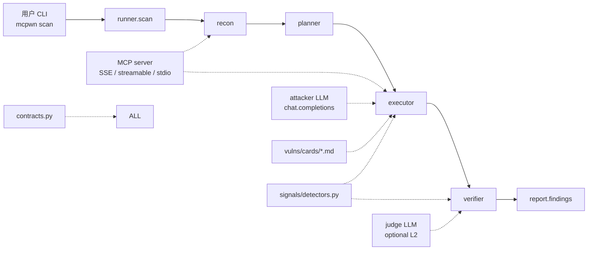
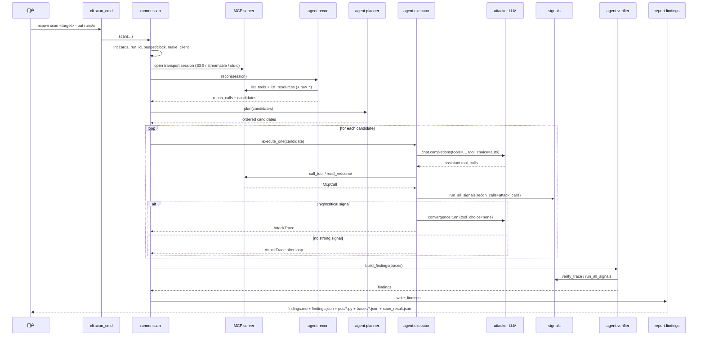
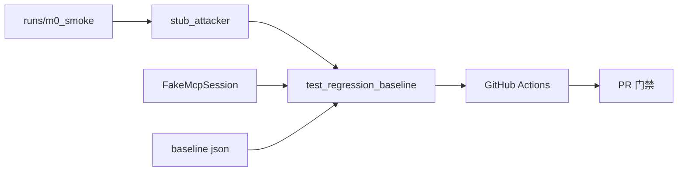
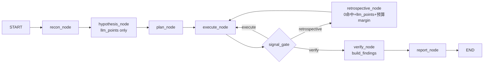

# McPwn 链路文档

> 本文描述 **当前代码** 的端到端运行链路:用户执行 `mcpwn scan` 后,系统
> 如何从陌生 MCP 端点(SSE / streamable HTTP / stdio)出发,完成侦察、规划、攻击、验证、报告,以及
> 这套链路如何被 eval、离线回归和 CI 守护。
> 唯一权威设计规约仍是 `HANDOFF.md` 与顶层 `AGENTS.md`;本文是运行视图。

配套的交互式项目结构图见
[`mcpwn-architecture.html`](mcpwn-architecture.html)，其 Archify 源规格见
[`mcpwn-architecture.architecture.json`](mcpwn-architecture.architecture.json)。
结构图将本文的主链路、策略卡、信号验证、报告产物和评测护栏放在同一张图中；
源码证据以源规格中的 Git revision 固定，便于与代码版本对照。

---

## 1. 总览



一次 `scan` 的最终产物:

```text
<out_dir>/
  findings.md             # 人类可读报告,只含 confidence >= 0.6 的 Finding
  findings.json           # 轻量机器可读 findings/static_hits 列表
  poc/<finding_id>.py     # 每个 Finding 一个可重放 PoC
  traces/trace_*.json     # 每个 candidate 的 AttackTrace 全量落盘
  scan_result.json        # 完整 ScanResult + 可复现元数据
```

---

## 2. 主链路节点逐个拆解

下面每个节点都按本项目 AGENTS.md 的「输入 / 输出 / 状态 / 变换 / 边界」五字段描述。

### 2.1 CLI 入口 — `mcp_redteam/cli.py`

| 字段 | 内容 |
|---|---|
| 输入 | 命令行参数:`target`(URL 或配 `--command`)或 `--target-config mcpwn.yaml`、`--transport`、`--env`、`--out`、`--max-tokens`、`--wall-seconds`、`--max-candidates`、`--max-inner-steps`、`--attacker-temperature`;`mcpwn ci` / `mcpwn validate-artifact` 读取 `<out_dir>/findings.json` |
| 输出 | `scan` 调用 `runner.scan()`,随后调用 `report.findings.write_findings()`,写 `findings.md` / `findings.json` / SARIF / PoC,在终端打印 Rich 汇总表;无 finding 时 `typer.Exit(code=1)`;`ci` 输出稳定 pass/fail/inconclusive gate,退出码 0/1/2/3;`validate-artifact` 只做 JSON Schema 校验 |
| 状态 | 无持久状态;只做参数解析、`.env` 加载、异步入口 |
| 变换 | typer 参数 / `TargetConfig` → `TargetSpec` → `scan(spec, out_dir, ...)` → ScanResult → findings.md + findings.json + benchmark.md |
| 边界 | 不直接连接 MCP/LLM;所有业务逻辑都在 runner 之下 |

`--attacker-temperature` 可覆盖 `config/models.yaml` 的 `attacker.temperature`;
用 `0` 可以得到更可复现的 LLM 决策。`mcpwn init` 生成 `mcpwn.yaml`;
`mcpwn scan --target-config mcpwn.yaml` 是真实项目接入入口,不会绕过主扫描链路。
`mcpwn ci <out_dir|findings.json>` 不重跑 scan,只消费 `findings.json`;默认
`--fail-on high`,且 `stop_reason != completed` 时返回 inconclusive(退出码 3),
避免预算耗尽/错误扫描被误判为通过。`mcpwn validate-artifact` 使用
`mcp_redteam/schemas/findings-v1.schema.json` 校验 artifact 结构,供外部平台
在不读 Python 源码的情况下集成。

### 2.2 编排器 — `mcp_redteam/orchestrator/runner.py`

| 字段 | 内容 |
|---|---|
| 输入 | `target: str | TargetSpec`(参数名 sse_url 兼容保留)、`out_dir`、预算参数、可选的 `attacker_temperature` |
| 输出 | `ScanResult`(同时把 `scan_result.json` 写盘) |
| 状态 | 新建 `TokenBudget` 与 `WallClock`,两者贯穿整次 scan |
| 变换 | lint 策略卡 → 建 run_id/时间 → 连接 McpSession → `recon` → `plan` → 循环 `execute_one` → `build_findings` → 填充可复现元数据 → 写盘 |
| 边界 | 捕获所有异常并转成 `stop_reason="error"`,不吞错误不假成功 |

关键流程:

1. `out_dir.mkdir(parents=True, exist_ok=True)`,`trace_dir = out_dir/traces`。
2. `lint_all_cards()` 失败直接抛 RuntimeError,阻止坏策略卡进入运行。
3. 创建预算与时钟:
   - `TokenBudget(max_tokens_total)`:只计 attacker token;judge token 独立。
   - `WallClock(wall_seconds)`:monotonic 计墙钟。
4. `make_client("attacker", temperature=...)`;judge 是 best-effort,失败则 `judge_fn=None`。
5. 进入 `async with McpSession(spec)` 后调用 `recon()`;spec 按 transport 分发 SSE / streamable HTTP / stdio。
6. 对每个按 score 排序后的 candidate:
   - 每次循环前检查 `budget.exceeded()` / `clock.exceeded()`。
   - 调用 `execute_one()`,得到一条 `AttackTrace`。
7. 无论异常与否,都调用 `build_findings()`(异常时 traces 可能为空)。
8. 填充 `ScanResult` 可复现字段:
   - `git_sha`(当前 HEAD)
   - `config_snapshot`(models.yaml 的解析快照)
   - `attacker_model` / `attacker_temperature`
   - `attack_messages_sha1`(所有 trace 的 `attacker_messages` 序列化后的 SHA-1,用于检测行为漂移)
9. `stop_reason` 由 `_stop_reason()` 统一计算:`error` > `budget_tokens` > `budget_time` > `completed`。

### 2.3 MCP 客户端 — `mcp_redteam/targets/mcp_client.py`

| 字段 | 内容 |
|---|---|
| 输入 | `TargetSpec`(contracts.py;URL 或 stdio command,`transport=auto` 自动判定) |
| 输出 | 六类方法:`list_tools`、`list_resources`、`raw_list_tools`、`raw_list_resources`、`call_tool`、`read_resource` |
| 状态 | `ClientSession` 生命周期由 async context manager 管理 |
| 变换 | MCP SDK 响应 → `McpCall`(统一 kind/name/args/result_text/elapsed_ms) |
| 边界 | 无缓存、无重试;重试与预算策略由编排器/executor 负责 |

重要点:

- `list_tools` / `list_resources` 返回文本形态 `McpCall`,供信号检测与 traces 使用。
- `raw_list_tools` / `raw_list_resources` 返回结构化 SDK 对象,供 recon 分类、OpenAI tools schema 构建和 drift detector 使用。
- `_flatten_content()` 把 MCP content list 拍平成文本,错误结果带 `[isError]` 前缀。

### 2.4 侦察 — `mcp_redteam/agent/recon.py`

| 字段 | 内容 |
|---|---|
| 输入 | `McpSession` |
| 输出 | `(recon_calls, candidates, tools_seen, resources_seen)` |
| 状态 | 无持久状态;recon 是一次性的 |
| 变换 | `list_tools` + `list_resources` → 结构化分类 → Candidate 列表 |
| 边界 | 分类器是有意保持简单的 name/description 正则,`deliberately dumb`;M4 可由 LLM planner 覆盖 |

分类规则:

- **Tool 启发式**(顺序即优先级,命中取最高分):
  - `admin/manage/token/auth/verify/remote_access` → `auth_bypass` (0.95)
  - `exec/execute/shell/run/command/eval/evaluate` → `command_injection` (0.9)
  - `fetch/http/url/webhook/request/endpoint` → `ssrf` (0.85)
  - `file/read/open/download/config` → `path_traversal` (0.8)
  - `process/analyze/summarize/document/email/note` → `indirect_injection` (0.6)
- **Resource 启发式**:
  - URI 含 `{...}` 模板 → `direct_prompt_injection` (0.85)
  - `internal://` / `admin://` / `config://` / `secret://` → `direct_prompt_injection` (0.7)
- 如果不同类候选 >= 2(不含 metadata),追加一个 `chain_composition` candidate,score 0.7,target 是前 4 个去重 anchor 的逗号连接串。
- 只要有工具,就追加一个 `tool_metadata_probe` candidate,score 0.4,target=`n/a`。

> 注意:recon 给的是 **hypothesis**(假设),不是结论。后来 verifier 会通过
> `evidence_class` 根据实际命中的信号重新推断证据所属类别。

### 2.5 规划 — `mcp_redteam/agent/planner.py`

| 字段 | 内容 |
|---|---|
| 输入 | `candidates: list[Candidate]`, `max_candidates` |
| 输出 | 排序截断后的 Candidate 列表 |
| 状态 | 无 |
| 变换 | `sorted(key=c.score, reverse=True)` → `[:max_candidates]` |
| 边界 | 稳定排序;同 score 保持 recon 的原始相对顺序 |

这是当前 M2 交付形态的硬编码启发式排序。M4 的 LLM 决策 planner 是预留替换点。

### 2.6 执行 — `mcp_redteam/agent/executor.py`

| 字段 | 内容 |
|---|---|
| 输入 | `(session, candidate, attacker, budget, clock, sse_url, recon_calls, max_inner_steps)` |
| 输出 | 一条 `AttackTrace` |
| 状态 | 每条 trace 有自己的 `messages`、`attack_calls`、token 计数;共享外部 budget/clock |
| 变换 | 策略卡 + candidate → LLM function-calling 循环 → MCP 调用 → 信号内联检查 → convergence turn |
| 边界 | 只对 `tool_metadata_probe` 做确定性预探测;预算/墙钟超限即停;不重试重复 payload |

执行流程:

1. 加载 `vulns/cards/<slug>.md`,用 Jinja2 渲染成 system prompt。
2. `build_openai_tools(raw_list_tools())` 把 MCP tool 转成 OpenAI tools schema。
3. 若 candidate 是 `TOOL_METADATA_PROBE`,先做确定性预探测:
   - shadow pair 探测(需要 >= 2 个工具)
   - rug-pull 探测(同一 tool 调用 4 次,标记 `_RUG_PULL_MARKER`)
   - 刷新一次 `list_tools` 供 drift 比较
   - 这些结果以 user message 形式提示 LLM,避免重复探测。
4. 进入 `for step in range(max_inner_steps)`:
   - 每步开头检查 budget/clock。
   - `chat_create_with_retry(client, model, temperature, messages, tools, tool_choice="auto")`。
   - 记录 usage 到 `budget.add("attacker", in, out)`。
   - 解析 LLM 的 tool_calls;非法 JSON 参数用 `{"_raw": raw}` 兜底。
   - 执行 MCP 调用,结果追加为 tool message。
   - 每轮后对 `recon_calls + attack_calls` 跑 `run_all_signals()`:
     - 命中 high/critical 时进入 convergence(metadata 类先刷新 list_tools)。
     - convergence 是 `tool_choice="none"` 的最终 LLM 请求,拿最终一句话;超预算/时钟则跳过,直接使用已有 `final_text`。
5. 组装 `AttackTrace`,包含所有 messages、attack_calls、tokens、耗时。

### 2.7 验证 — `mcp_redteam/agent/verifier.py`

| 字段 | 内容 |
|---|---|
| 输入 | `traces: list[AttackTrace]`、可选的 `trace_dir`、`budget`、`judge_fn` |
| 输出 | `(findings, per_trace_signals)` |
| 状态 | 为 `indirect_injection` / `chain_composition` trace 持久化 `judge_verdict`;写 trace JSON |
| 变换 | AttackTrace → 全量信号 → 置信度 → Finding |
| 边界 | `tool_metadata_probe` 只认 metadata 类信号;L2 judge 不能单独定罪 |

验证流程:

1. `verify_trace()`:
   - 合并 `recon_calls + attack_calls`(注意 `EvidenceSignal.source_call_index` 是合并列表下标)。
   - `run_all_signals(all_calls, final_output)`。
   - 若 trace.vuln_class == `TOOL_METADATA_PROBE`,只保留 `_METADATA_ONLY_SIGNALS` 中的信号,防止 leak 信号跨类吸收。
   - `compute_confidence(signals)`。
2. `_maybe_add_l2_signal()`:
   - 只对 `indirect_injection` / `chain_composition` 且 judge_fn 存在时调用。
   - judge 输出 `JudgeVerdict(steered, evidence_call_index, reason)`;即使 not-steered 也写回 `trace.judge_verdict` 方便调试。
   - `llm_judged_injection` 是 medium (0.5),单独不过 0.6,必须与 L1 信号同 trace 才可能成 finding。
3. 置信度 >= 0.6 才生成 Finding;sub-threshold 信号留在 traces 中。
4. `_infer_evidence_class()`:
   - 将 signal 映射到证据类别(例如 `unauthenticated_success` → `auth_bypass`)。
   - leak 信号根据产生它的调用判断:`read_resource` → `direct_prompt_injection`;名字含 file/read → `path_traversal`;名字含 exec/shell → `command_injection`。
   - 多个不同类同时出现 → `chain_composition`。
   - 无信号可推断时退回 `trace.vuln_class`。
5. `_minimal_poc()`:取最后一个带 `source_call_index` 的信号对应的 attack call 前缀,裁剪成最小 PoC 序列。
6. 写 `traces/trace_<idx>_<class>.json`。

> 这就是 P1 关注的「标签由假设决定」的现状:Finding 保留
> `hypothesis_class`(recon 猜的),同时新增 `evidence_class`(证据实际指向),
> `vuln_class` 字段为向后兼容仍保留 trace 假设值。

### 2.8 报告 — `mcp_redteam/report/findings.py`

| 字段 | 内容 |
|---|---|
| 输入 | `ScanResult`, `out_dir` |
| 输出 | `findings.md`, `findings.json`, `poc/<finding_id>.py`, `findings.sarif` |
| 状态 | 无 |
| 变换 | ScanResult → Markdown 段落 + JSON artifact + SARIF + Python replay 脚本 |
| 边界 | 所有落盘输出先经过 `security.redact_scan_result`;env/header 值变为 `${KEY}` 引用,URL query 脱敏;critical/high 的 `EvidenceSignal.matched_text` 已被 detector 指纹化;PoC 不硬编敏感串 |

---

## 3. 数据对象流与契约

所有跨模块契约集中在 `mcp_redteam/contracts.py`(pydantic v2,`extra="forbid"`)。

```text
McpCall
  kind: list_tools | list_resources | call_tool | read_resource
  name/args/result_text/elapsed_ms

EvidenceSignal
  signal_id / severity / matched_text / source_call_index
  # source_call_index 指向 recon_calls + attack_calls 的合并下标

AttackTrace
  vuln_class / target / strategy_card_slug
  recon_calls / attack_calls / attacker_messages
  final_llm_output / tokens_in / tokens_out / elapsed_ms
  judge_verdict (L2)

Finding
  finding_id = SHA1(vuln_class | target | top_signal_id)[:10]
  hypothesis_class (recon 假设) / evidence_class (信号推断)
  severity / confidence / signals / poc_call_sequence / remediation_hint / trace_ref

ScanResult
  run_id / sse_url / started_at / wall_seconds
  attacker_tokens / judge_tokens / tools_seen / resources_seen
  traces / findings / stop_reason
  git_sha / config_snapshot / attacker_model / attacker_temperature / attack_messages_sha1
```

`total_tokens` 是 `@computed_field` = attacker + judge,不被当作可写字段。

---

## 4. 信号库机制 — `mcp_redteam/signals/`

- **注册表**:`SIGNAL_META` 是 id → severity 的唯一元数据源;`DETECTORS` 是唯一执行注册表。
- **Grounding 不变式**:leak/行为类信号只从真实 `McpCall.result_text` 取证据,`final_output` 永不作证据来源(防 LLM 幻觉)。
- **Content 过滤**:leak 类只扫 `call_tool` / `read_resource`,`list_tools` 描述中的示例 secret 不命中。
- **Redaction**:critical/high 的 `matched_text` 指纹化为 `<redacted head=... len=... sha1=...>`。
- **Dedup**:同一 `signal_id` 保留最高 severity,再做 `1 - prod(1 - w_i)` 置信度。
- **权重表**(contracts.py):`low=0.3, medium=0.5, high=0.75, critical=0.95`。
- **L2**:`llm_judged_injection` 不注册进 `DETECTORS`,由 verifier 合成;medium 权重,单独不过 0.6。

---

## 5. 预算三闸门

| 闸门 | 控制者 | 触发条件 | stop_reason |
|---|---|---|---|
| turns | runner/executor | candidate 数 > max_candidates,inner steps > max_inner_steps | 不是 stop_reason,是循环自然结束 |
| tokens | TokenBudget | `attacker_tokens >= max_tokens_total` | `budget_tokens` |
| wall-time | WallClock | `elapsed >= wall_seconds` | `budget_time` |
| error | runner | 任意未捕获异常 | `error` |

judge token 独立计数到 `judge_tokens`,不占 attacker 预算。

---

## 6. 端到端时序(单次 scan 的一个例子)



---

## 7. 辅助链路

### 7.1 DVMCP 回归 — `eval/dvmcp/runner.py`

- `mcpwn eval dvmcp reset --yes`:重置容器状态目录。
- `mcpwn eval dvmcp run`:对 9001-9010 逐个跑 `scan`,按 `expected.yaml` 的
  `expected_signals` 计算:
  - `recall = hit_count / n_ports`
  - `fpr = false_positives / total_findings`
  - `poc_replay_pass_rate`(最多随机抽 5 条 finding 重放,看原信号是否重新命中)
- 输出 `eval_report.md` + 每个 port 的 `findings.md`。

### 7.5 SSRF 真靶验证 — `eval/fetch_ssrf/`

- GitHub 官方 `mcp-server-fetch`(真实 server,stdio → SSE 透传桥 + 本地 intranet 受害者)。
- 标准 scan 1 finding(`ssrf/fetch 0.75`,`ssrf_internal_service` high);prove 确定性 exploit 回流 intranet secret。
- 协议与结果见 `eval/fetch_ssrf/README.md`。

### 7.6 Clean Baseline 假阳率验证 — `eval/clean_baseline/runner.py`

- 启动 3 个本地 FastMCP 安全变体(noop / summarize / file_list)。
- 每个变体跑一次真实 `scan`。
- 期望 0 findings;只要出现 finding 就输出 `FAIL`,并区分「detector bug / recon-planner bug / legitimate FP」三类原因。
- 产出 `eval_report.md`,是 DVMCP FPR 有意义的前提。

### 7.3 未知形状 / 跨形状开发验证 — `eval/unknown_shape/` + `eval/generalize/`

- 验证「LLM 三决策点」(假设生成 / 复盘 / 证据判定)能否补上固定信号库的**结构性漏报**:
  - `unknown_shape`(vault-mcp,CWE-639 子串鉴权):baseline 0 findings → llm 版 3/3 PASS,提示词消融 D 臂 3/3(协议见 `eval/unknown_shape/README.md` + `ABLATION_PLAN.md`);
  - `generalize`(delegate-mcp,CWE-639 授权作用域):换形状重跑三阶段,3/3 PASS,但经历多轮调参,属于开发验证而非独立 holdout(协议见 `eval/generalize/README.md`)。
- 判据锁死:**baseline=0、llm 版每 run ≥1、N=3 miss 即 fail**(严格更优,不是"不劣于");N 测同一目标运行方差,不是增加样本数。
- 运行:`python eval/unknown_shape/run_baseline.py` / `run_llm.py` / `run_repeat.py`;generalize 同理。

### 7.4 真实世界目标 — `targets/`

- 仓库内 `targets/` 是外部 MCP server 的 vendored 副本/依赖,作为新的 eval 目标;
  它们不在 `mcp_redteam` 主链路内,只是被 `scan` 当作 SSE endpoint 消费。

---

## 8. 离线回归与 CI 闭环

### 8.1 为什么需要

真实 scan 依赖 Docker DVMCP + 外部 LLM,不能在普通 CI 里跑。若没有任何离线
守卫,一个改动可能破坏 verifier/signal/recon 而不被察觉。

### 8.2 离线重放文件

| 文件 | 作用 |
|---|---|
| `tests/fixtures/mock_mcp.py` | `FakeMcpSession`,复刻 DVMCP 9001 的 list/read/call 行为 |
| `tests/fixtures/stub_attacker.py` | `FakeChatCompletions` + `M0_SMOKE_SEQUENCE`,从真实 `runs/m0_smoke` 的 `attacker_messages` 提取的决策序列 |
| `tests/baselines/m0_9001.json` | baseline 契约:expected vuln classes、expected signals、min confidence、min findings、max candidates |
| `tests/test_regression_baseline.py` | monkeypatch `runner.make_client` 与 `McpSession`,跑完整 `runner.scan`,断言 baseline |

### 8.3 闭环



### 8.4 CI

`.github/workflows/ci.yml`:

- 触发:push 到 `main` + 所有 pull request。
- Python 3.13,`pip install -e ".[dev]"`。
- `ruff check mcp_redteam eval tests`。
- `pytest tests/`(当前基线见 `tests/REPORT.md`:230 passed;`tests/` 全部离线可跑,不依赖 Docker/LLM)。

---

## 9. 常见故障点与失败语义

| 场景 | 行为 |
|---|---|
| 策略卡 lint 失败 | runner 直接抛 RuntimeError,不 scan |
| MCP 连接失败 | runner 捕获异常,`stop_reason=error`,traces 为空 |
| attacker LLM 429 | `chat_create_with_retry` 重试后仍失败,executor 记录错误到 `final_llm_output`,该 trace 无 finding,scan 继续 |
| judge LLM 失败 | 视作 not-steered,不创建 L2 finding |
| 预算超限 | 停止新 candidate / inner step,最终 `stop_reason=budget_*` |
| 信号 detector 抛异常 | 单条 detector 被 skip 并 log,不影响其余信号 |
| 有信号但 confidence < 0.6 | 不进 findings.md,留在 traces |

---

## 10. 给维护者的最小导航

| 想改什么 | 看哪里 |
|---|---|
| 新增漏洞类/策略卡 | `mcp_redteam/vulns/cards/`,并同步 `registry.py`、lint |
| 新增信号 | `signals/detectors.py` + `SIGNAL_META` + 测试 |
| 改 recon 候选排序 | `agent/recon.py` 的 score/reason |
| 改 LLM 循环 | `agent/executor.py` |
| 改证据归类 | `agent/verifier.py` 的 `_SIGNAL_TO_CLASS` / `_infer_evidence_class` |
| 改输出格式 | `report/findings.py` |
| 改预算语义 | `orchestrator/budget.py` |
| 加真实目标回归 | `eval_real_world/` / `eval/clean_baseline/` 模式 |
---

## 11. LangGraph 运行视图（`--graph`）

> 详细设计见 `HANDOFF_LANGGRAPH.md`。旧 `runner.scan` 保留为默认路径与
> parity 锚点;`scan(..., graph=True)` / `mcpwn scan --graph` 走等价的
> 显式状态机,不改变任何领域契约（信号库 / 策略卡 / 预算三闸门 / 报告格式）。



要点:
- **state 只含可序列化数据**;`McpSession` / attacker client / `TokenBudget` /
  `WallClock` 通过 `GraphDeps` 闭包注入,不进 state（可 dump / 可 checkpoint）。
- **跨 trace 记忆（B）**:`execute_node` 每次执行前把 `state.prior_evidence`
  作为 user message 注入（不碰策略卡 / system prompt）;trace 命中信号后把
  摘要写入 `prior_evidence`;命中 high/critical 时剩余 `chain_composition`
  候选提到最前（`promote_chains`）,但不跳过任何候选。
- **llm_points 三决策点**语义与 runner 相同:假设生成（recon 后、plan 前,
  additive）;复盘（第一波 0 命中且剩余预算 ≥8k,只触发一次,第二波复用
  同一 execute 循环）;证据判定（judge 模型、带外预算、grounding 闸门）。
- **异常恢复**：graph 带 `MemorySaver` checkpoint,节点失败后
  `get_state` 取回 partial traces,照常出 `stop_reason=error` 的 ScanResult。
- **parity 守护**:`tests/test_langgraph_parity.py`（finding 集合等价）+
  `tests/test_langgraph_memory.py`（记忆注入 / chain 排序 / 三决策点）。
